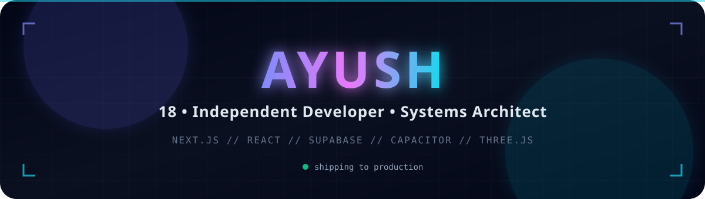

  

 

I architect and ship production-grade software. From real-time database syncing to custom WebAudio engines and automated metadata pipelines, I focus on building systems that scale. Currently exploring the intersection of AI, 3D web experiences, and cross-platform mobile architectures.

---

### 🛠️ What I Build

*   **Cross-Platform Mobile Apps:** Single codebase React apps deployed to iOS/Android via Capacitor.
*   **Real-time Web Platforms:** Chat, dashboards, and collaborative tools using Supabase & Firebase.
*   **AI-Powered Tools:** Custom LLM wrappers, RAG pipelines, and automated content generators.
*   **3D & Generative UI:** Immersive web experiences using Three.js and WebGL shaders.
*   **Music Tech Integrations:** API mashups between streaming platforms, metadata providers, and distributors.

---

### 🚀 Flagship Projects

<table>
  <tr>
    <td width="50%" valign="top">
      <h3>⚡ Prepare-X (CUET Arena)</h3>
      
<strong>Next.js 15 • Zustand • TypeScript • WebAudio API</strong>

      
A high-fidelity exam simulator handling <strong>1200+ questions</strong> with O(1) state lookups. Features a custom WebAudio sound engine, canvas-based confetti physics, and a 3.8M-token AI-assisted data pipeline for parsing real shift PDFs into structured JSON packs.

    </td>
    <td width="50%" valign="top">
      <h3>💬 Nexus</h3>
      
<strong>React • Capacitor • Supabase Realtime • Tailwind</strong>

      
A cross-platform messaging architecture. Engineered a low-latency chat infrastructure using Supabase Realtime subscriptions, wrapped in Capacitor for native iOS/Android deployment with offline-first state management.

    </td>
  </tr>
  <tr>
    <td width="50%" valign="top">
      <h3>🎵 Aurix</h3>
      
<strong>YouTube iframe API • MusicBrainz • Node.js</strong>

      
An automated music distribution pipeline. Bridges streaming APIs with metadata providers (iTunes/MusicBrainz) to fetch rich thumbnails and tags, automating RT uploads to distributors like Spotify.

    </td>
    <td width="50%" valign="top">
      <h3>📐 Maths Patterns</h3>
      
<strong>Three.js • WebGL • GLSL Shaders</strong>

      
An interactive factual visualizer exploring algorithmic rendering and mathematical sequences. Built to make complex numerical patterns visually intuitive through procedural generation.

    </td>
  </tr>
</table>

---

### 🧰 Tech Stack

**[ Frontend & UI ]**

**[ Backend & Infrastructure ]**

**[ Mobile & DevOps ]**

---

### 📊 GitHub Telemetry

  
  

  

  

---

  Built with raw HTML, Markdown, and a lot of coffee. ☕

