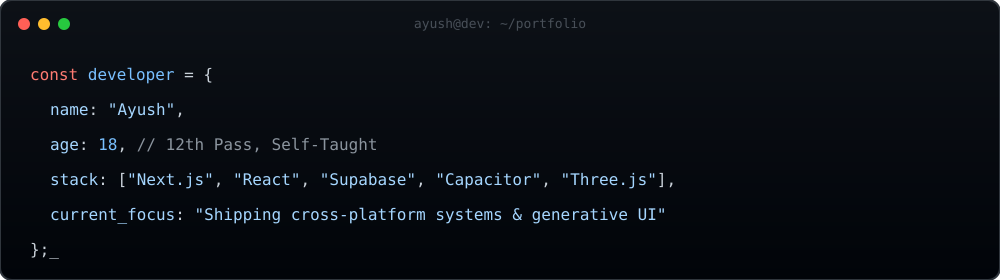

  

 

I am an 18-year-old independent engineer building high-performance web and mobile applications. I don't just write code; I architect systems. From real-time database syncing to custom WebAudio engines and automated metadata pipelines, I focus on shipping production-grade software that scales.

---

### // 01. FEATURED_SYSTEMS

<table>
  <tr>
    <td width="50%" valign="top">
      <h3>⚡ Prepare-X (CUET Arena)</h3>
      
<strong>Next.js 15 · Zustand · TypeScript · WebAudio API</strong>

      
A high-fidelity exam simulator handling <strong>1200+ questions</strong> with O(1) state lookups. Features a custom WebAudio sound engine, canvas-based confetti physics, and a 3.8M-token AI-assisted data pipeline for parsing real shift PDFs into structured JSON packs.

    </td>
    <td width="50%" valign="top">
      <h3>💬 Nexus</h3>
      
<strong>React · Capacitor · Supabase Realtime · Tailwind</strong>

      
A cross-platform messaging architecture. Engineered a low-latency chat infrastructure using Supabase Realtime subscriptions, wrapped in Capacitor for native iOS/Android deployment with offline-first state management.

    </td>
  </tr>
  <tr>
    <td width="50%" valign="top">
      <h3>🎵 Aurix</h3>
      
<strong>YouTube iframe API · MusicBrainz · Node.js</strong>

      
An automated music distribution pipeline. Bridges streaming APIs with metadata providers (iTunes/MusicBrainz) to fetch rich thumbnails and tags, automating RT uploads to distributors like Ditto and Spotify.

    </td>
    <td width="50%" valign="top">
      <h3>🎨 Generative & 3D UI</h3>
      
<strong>Three.js · WebGL · GLSL Shaders</strong>

      
Experimenting with the intersection of math and design. Building immersive, dark-aesthetic web experiences using custom shaders, particle systems, and procedural generation.

    </td>
  </tr>
</table>

---

### // 02. TECH_STACK

**[ Frontend & UI ]**

**[ Backend & Infrastructure ]**

**[ Mobile & DevOps ]**

---

### // 03. METRICS & ACTIVITY

  
<strong>📊 GitHub Telemetry</strong>

   
  

    
    
  

  

    
  

  
<strong>🐍 Contribution Grid</strong>

   
  

    
  

 

---

  Built with raw HTML, Markdown, and a lot of coffee. ☕

