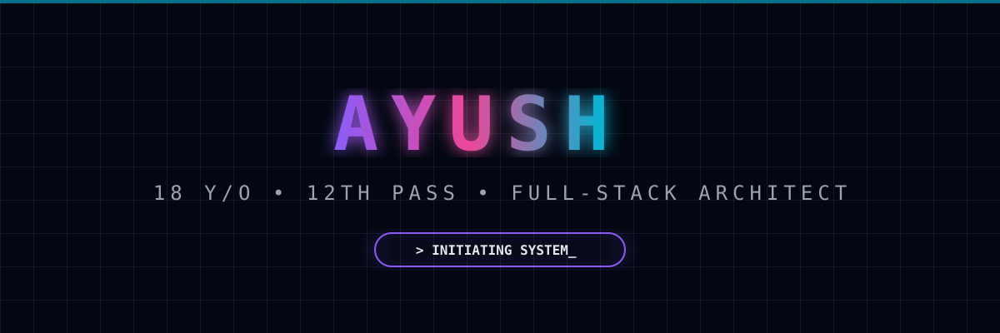
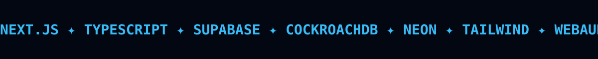

<p align="center">
  
</p>

<p align="center">
  
</p>

<br/>

```yaml
ayush@architect:~$ cat profile.json
--------------------------------------------------------
NAME ........... Ayush
AGE ............ 18
EDUCATION ...... 12th Pass (Science)
ROLE ........... Indie Hacker / Full-Stack Architect
DBS ............ Neon • CockroachDB • Supabase
STACK .......... Next.js, TypeScript, Tailwind... and all.
STATUS ......... Building in public, shipping daily.
--------------------------------------------------------
