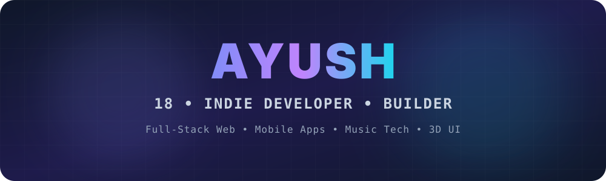
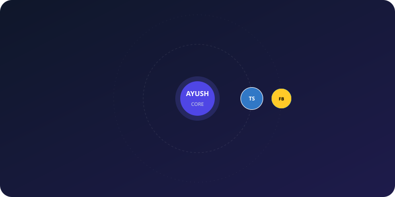

<p align="center">
  
</p>

<p align="center">
  
</p>

<p align="center">
  
</p>

<br/>

```yaml
ayush@dev:~$ whoami
------------------------
Name: .................. Ayush
Age: ................... 18
Education: ............. 12th Pass (Science)
Role: .................. Independent Developer & Builder
Focus: ................. Full-Stack Web, Mobile Apps, Music Tech
Current Obsession: ..... AI Integrations & 3D Web Experiences
Status: ................ Shipping to Production 🚀
🚀 Flagship Projects
<table>
<tr>
<td width="33%" valign="top">
<h3 align="center">🎓 Prepare-X</h3>
<p align="center">


</p>
<p align="center">
<b>CUET Prep Arena</b><br/>
A premium exam simulator with 1200+ real shift PYQs, animated UI, adaptive scoring, and WebAudio sound engines.
</p>
</td>
<td width="33%" valign="top">
<h3 align="center">💬 Nexus</h3>
<p align="center">


</p>
<p align="center">
<b>Real-time Chat App</b><br/>
Cross-platform messaging app with instant sync, presence indicators, and secure auth. Powered by Supabase real-time DB.
</p>
</td>
<td width="33%" valign="top">
<h3 align="center">🎵 Aurix</h3>
<p align="center">


</p>
<p align="center">
<b>Music Streaming & Dist.</b><br/>
Streams via YT iframe, fetches metadata from iTunes/MusicBrainz, and automates RT uploads to Ditto/Spotify.
</p>
</td>
</tr>
</table>

🛠️ What I Can Build For You
Based on my stack, I architect and ship:
📱 Cross-Platform Mobile Apps: Single codebase React apps deployed to iOS/Android via Capacitor.
⚡ Real-time Web Platforms: Chat, dashboards, and collab tools using Supabase & Firebase.
🤖 AI-Powered Tools: Custom LLM wrappers, RAG pipelines, and automated content generators.
🎨 3D & Generative UI: Immersive web experiences using Three.js and WebGL shaders.
🎧 Music Tech Integrations: API mashups between streaming platforms, metadata providers, and distributors.
<br/>

🛠️ Tech Stack


<br/>

📊 GitHub Stats
<p align="center">


</p>

<p align="center">

</p>

<p align="center">

</p>

<br/>

📈 Activity Graph
<p align="center">

</p>

<br/>

🐍 Contribution Snake
<p align="center">

</p>

<br/>

🌐 Connect
<p align="center">
<a href="https://linkedin.com/in/YOUR-LINKEDIN"></a>
<a href="mailto:YOUR-EMAIL"></a>
</p>

<p align="center">

</p>
